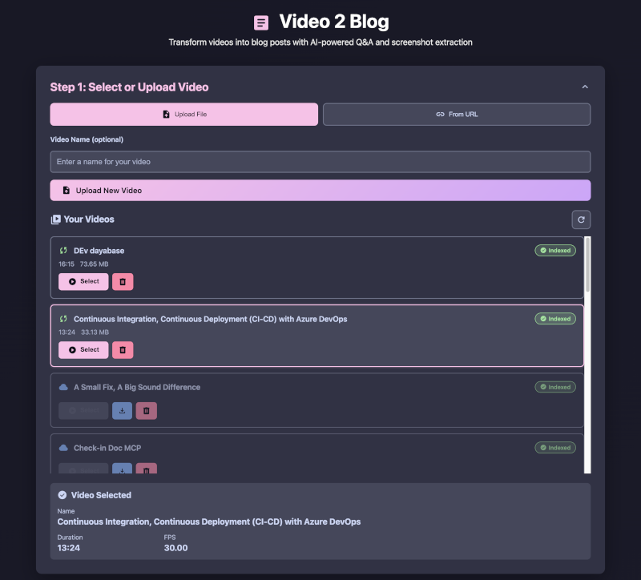
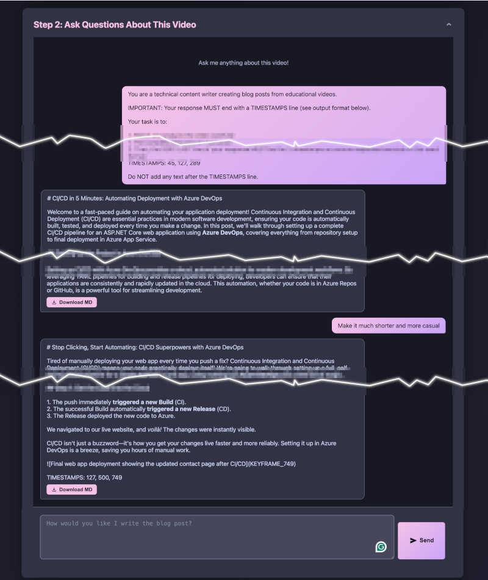
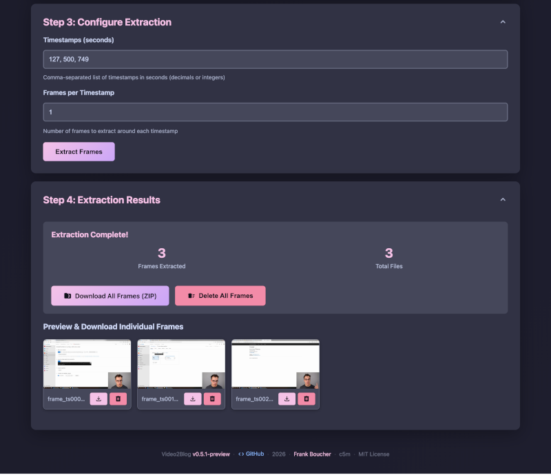

# Video 2 Blog

[](https://github.com/fboucher/video2blog/actions/workflows/docker-build.yml)   

A web application that transforms videos into blog posts using AI. Upload or link a video, generate a draft with Gemini AI, refine it in the **AI Blog Editor** with AI-powered skills, and extract keyframes to illustrate your post.

## Quick Start

### Build and Run

```bash
# Run with docker-compose (recommended)
docker-compose up -d

# Or run manually
docker run -d --name video2blog -p 5123:5000 \
  -v $(pwd)/uploads:/app/uploads \
  -v $(pwd)/output:/app/output \
  -v $(pwd)/data:/app/data \
  -v $(pwd)/skills:/app/skills \
  --env-file .env \
  fboucher/video2blog
```

### Access the Application

Open your browser and navigate to: **http://localhost:5123**

## Environment Variables

Create a `.env` file with the following variables:

| Variable | Required | Description | Default |
|----------|----------|-------------|---------|
| `GEMINI_API_KEY` | Yes | Google Gemini API key | — |
| `GEMINI_MODEL` | Yes | Gemini model to use | `gemini-3.1-flash-lite` |
| `EDITING_PROVIDER` | Yes | AI provider for editing: `anthropic` or `openai` | `anthropic` |
| `EDITING_API_KEY` | Yes | API key for the editing provider | — |
| `EDITING_MODEL` | No | Model for editing. Defaults: `claude-sonnet-4-6` (Anthropic) or `gpt-4o-mini` (OpenAI) | — |
| `EDITING_BASE_URL` | No | Custom OpenAI-compatible endpoint (optional) | — |
| `SKILLS_FOLDER` | No | Path to skills folder | `./skills` |

Example `.env`:
```
GEMINI_API_KEY=your_gemini_api_key_here
GEMINI_MODEL=gemini-3.1-flash-lite
EDITING_PROVIDER=anthropic
EDITING_API_KEY=your_anthropic_api_key_here
EDITING_MODEL=claude-sonnet-4-6
SKILLS_FOLDER=./skills
```

## How It Works

### Step 1: Select a video

You can upload a video file or provide a YouTube URL.



### Step 2: Chat with AI

Chat with Gemini to refine the initial analysis and generate your blog post draft.



### Step 3: Extract keyframe images

The application extracts keyframes from the video and generates images with captions.



### Step 4: Edit with AI Blog Editor

Open the **AI Blog Editor** to refine your draft using AI-powered skills. The split-pane editor includes:
- **Draft panel** (left): Your blog post with full editing control
- **AI tools panel** (right): Pre-built skills and custom prompt box
- **Skills**: Click a skill to run it against your draft and apply suggestions
- **Custom prompt**: Write any instruction for the AI to follow
- **Version history**: Every edit is versioned; restore previous versions anytime
- **Apply button**: Accept AI suggestions directly into your draft

## Extending with Custom Skills

Skills are Markdown files with YAML front matter stored in the `skills/` folder. Each skill defines a reusable AI editing task.

### Skill Structure

Create a new folder in `skills/` with a `SKILL.md` file:

```markdown
---
name: my-custom-skill
description: What this skill does
---
You are a specialized editor. Your task is to...

Return the edited text with no commentary.
```

**YAML Front Matter:**
- `name`: Unique identifier for the skill
- `description`: One-line description shown in the UI

**Prompt Body:** The system prompt that guides the AI on how to edit the text.

### Built-in Skills

Two example skills are included:

1. **edit-video-blog** — Refines video-to-blog drafts for clarity, flow, and SEO. Fixes grammar, improves readability, strengthens headers.

2. **text-editor** — General-purpose copy editing with modes for full edits, quick passes, section rewrites, tone checks, and headline workshops.

### Adding Your Own

1. Create a folder in `skills/` (e.g., `skills/my-skill/`)
2. Add a `SKILL.md` file with your YAML front matter and prompt
3. The skill is loaded automatically; no restart required
4. The `skills/` folder is mounted as a Docker volume, so you can add skills without rebuilding

## Contributing

Contributions are welcome! Whether it's a bug fix, a new feature, or a custom skill — see [CONTRIBUTING.md](CONTRIBUTING.md) to get started.

💬 Prefer chatting? Join the community on [Discord](https://discord.gg/6zA3jKw).

## Resources

- [Google Gemini API](https://ai.google.dev/) — Get an API key at [Google AI Studio](https://aistudio.google.com/)
- [Anthropic Claude API](https://www.anthropic.com/api) — Get an API key from the Anthropic console
- [OpenAI API](https://platform.openai.com/api/keys) — Get an API key from OpenAI
